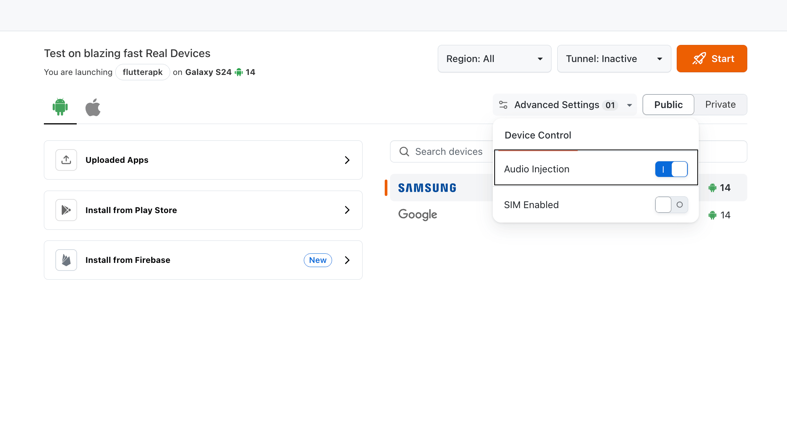
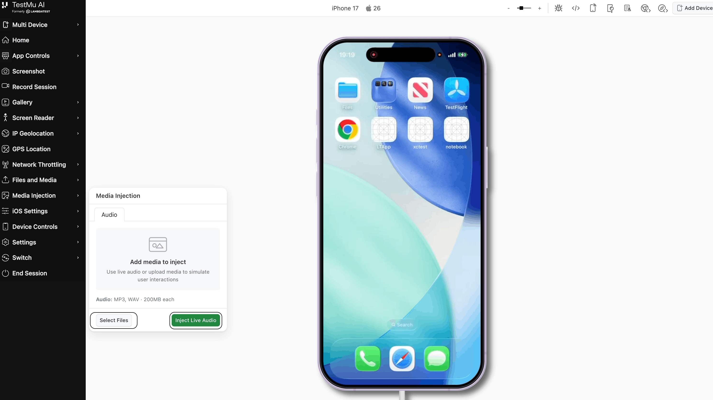
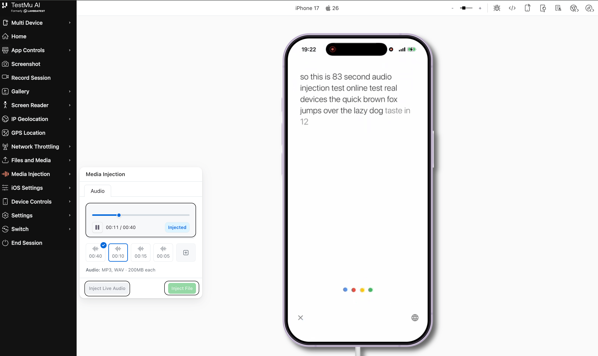
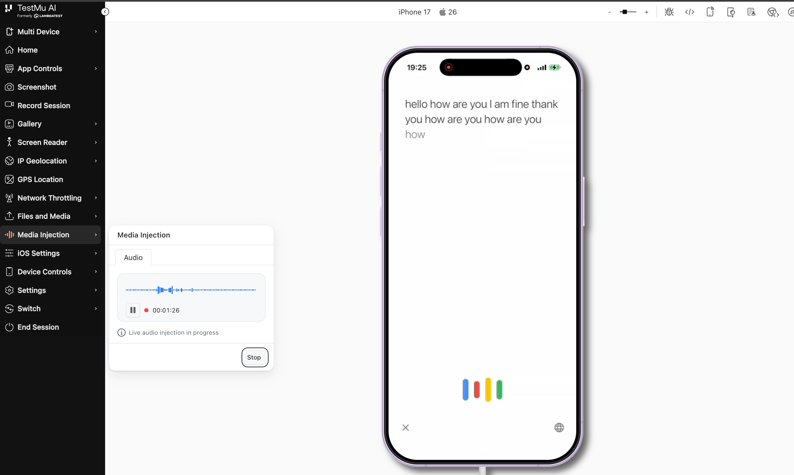

import CodeBlock from '@theme/CodeBlock';
import Tabs from '@theme/Tabs';
import TabItem from '@theme/TabItem';

import BrandName, { BRAND_URL } from '@site/src/component/BrandName';

# Audio Injection Manual Testing on Real Devices

**Audio Injection** lets you simulate microphone input on real Android and iOS devices during a manual **App Live** session. Use it to test speech-to-text, voice commands, voice assistants, in-app recording, KYC voice verification, and any other microphone-dependent feature — without speaking into a physical mic.

With <BrandName /> App Live, you can either inject a **pre-uploaded audio file** or stream **Live Input** directly from your system microphone into the device under test.

> To enable it for your organization, please contact us via  window.openLTChatWidget()}>**24×7 chat support** or you can also drop a mail to **support@testmuai.com**. 

---

## Use Cases

- **Voice command testing**: Validate voice assistants and in-app voice search.
- **Speech-to-text validation**: Confirm transcription accuracy across devices.
- **In-app audio recording**: Verify that the app captures and stores microphone input correctly.
- **KYC and voice verification**: Test identity flows that require a recorded voice sample.
- **Live conversational testing**: Use Live Input to drive ad-hoc, interactive voice flows in real time.

---

## Supported Platforms

| Platform | Minimum OS Version | 
|---|---|
| **Android** | Android 13 (SDK 33) and above 
| **iOS** | iOS 16 and above 

Audio Injection is supported on **selected real devices only** 

---

## Supported File Formats

| Format | Max Size |
|---|---|
| MP3 | 200 MB |
| WAV | 200 MB |

Files are uploaded one at a time and injected one at a time per session.

---

## Manual Audio Injection Workflow in App Live

### Step 1: Enable Audio Injection in Advanced Settings

1. Go to the <BrandName /> **Dashboard** and open **Real Device App Testing**.
2. Click **Advanced Settings** on top. 
3. Toggle **Enable Audio Injection** on.

Once enabled, the device list is filtered to show **only the devices that support Audio Injection** for the respective OS.

---

### Step 2: Select a Device and Start Your Session

1. From the filtered device list, choose your app and pick a supported Android or iOS real device.
2. Click **Start** to launch the session.

---

### Step 3: Open Media Injection

1. Inside the live session, locate the **Media Injection** option in the in-session toolbar.
2. Click to open the Media Injection panel.
3. Switch to the **Audio** tab.

You will see two options:

- **Select Files** — inject a pre-recorded audio file
- **Inject Live Input** — stream audio from your system microphone in real time

---

### Step 4a: Inject an Audio File

Use this mode when you want a deterministic, repeatable input — for example, the same voice command run across many devices.

1. In the **Audio** tab, select **Select Files**.
2. Click **Upload** and choose an `.mp3` or `.wav` file (up to **200 MB**, one file at a time).
3. Once uploaded, the file appears in your audio library (latest 5 uploaded)
4. In the app under test, navigate to the screen that captures microphone input (e.g., tap **Record** or **Start Voice Search**).
5. Select the uploaded file and click **Inject**.
6. Once a file is injected, the controls are limited to **Play** and **Pause** — clicking **Play** streams the audio into the device's microphone pipeline as live mic input, and the app captures it as if a user were speaking.
7. To switch audio, select a different file and click **Inject** on it. Only **one file can be injected at a time**, and the new file replaces the previously injected one.

:::tip
Inject and start playback **after** the app has opened the mic. Some recognizers need 1–2 seconds of silence to initialize before they accept speech.
:::

---

### Step 4b: Use Live Input

Use this mode when you want to drive the device microphone interactively — for example, holding an unscripted conversation with a voice assistant or testing custom prompts on the fly.

1. In the **Audio** tab, select **Inject Live Input**.
2. Grant microphone access to your browser when prompted.
3. In the app under test, open the screen that captures microphone input.
4. Click **Start** — your system microphone is now streamed directly into the device's mic.
5. Speak into your mic. The app receives your voice in real time.
6. Click **Stop** to end the live stream.

:::note
Live Input streams from the same browser tab running App Live. Avoid muting your system mic or switching tabs mid-session — the stream will be interrupted.
:::

---

## Execution Rules

- The app must be granted microphone permission. Audio Injection does **not** bypass permission prompts.
- Only one audio source is active at a time — switching from **Files** to **Live Input** (or vice versa) replaces the previous source.
- For files, only one file can be injected and played at a time.
- The last injected audio is the active source until you stop it or inject another.

---

## Tips and Best Practices

- Keep audio files short (under 5 minutes) for predictable timing.
- Use 16 kHz mono MP3 or WAV for the most consistent results across Android and iOS.
- For voice-recognition tests, allow the device 1–2 seconds of silence before injecting speech.
- Use **Files** for repeatable regression tests; use **Live Input** for exploratory and conversational testing.

---

## Related Resources

- [Audio Injection on Real Devices (Automation)](/docs/audio-injection/) — Inject audio via Appium / Selenium tests
- [Camera Image Injection on Real Devices](/docs/camera-image-injection-on-real-devices/)
- [Biometric Authentication on Real Devices](/docs/biometric-authentication-on-real-devices/)

---

> **Need help?** Reach out via  window.openLTChatWidget()}>**24×7 chat support** or email **support@testmuai.com**.
